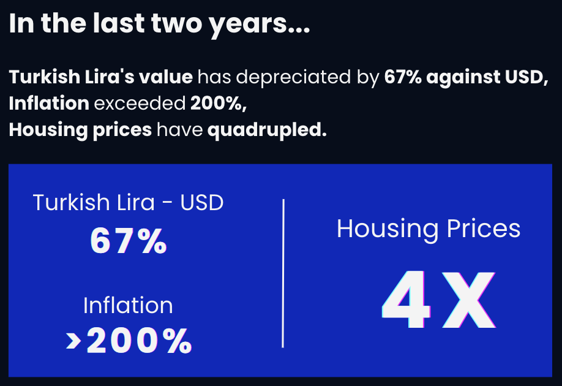
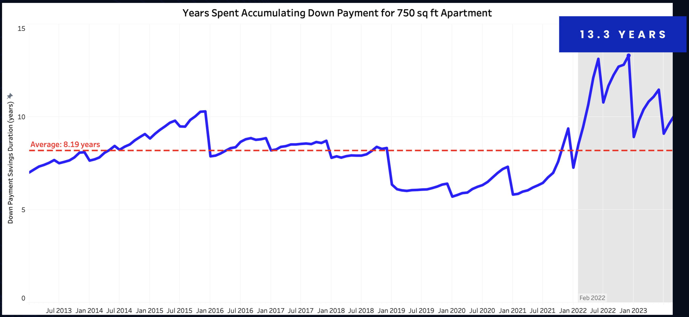
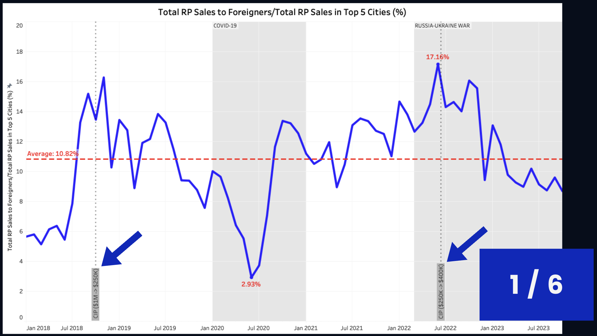

# Predictive Modeling for Residential Property Price Index in Istanbul
This project focuses on forecasting the residential property price index (RPPI) for Istanbul using machine learning models. The goal is to provide accurate predictions for the years 2022 and 2023 based on historical data spanning from 2014 to 2021.

<p align="center"></p>

The forecasting of the residential property price index for Istanbul was approached by employing regression models with diverse parameters to predict the continuous quantity of the index. Eight years of historical data spanning from 2014 to 2021 were leveraged, and a comprehensive exploration and hyperparameter optimization process was undertaken to ensure optimal model performance.

A total of 26,400 machine learning models were trained, considering various regression models and hyperparameter settings, resulting in the selection of the most effective predictor.

**Authors and Contact Information:** 
- [Asli Keser](https://github.com/aslikeser)
- [Linkedin](https://www.linkedin.com/in/asli-keser/)
- [aslikeser7@gmail.com](mailto:aslikeser7@gmail.com)

## Overview
In the last two years, housing prices in Turkey have skyrocketed, **quadrupling** in an unprecedented surge that has reshaped the real estate landscape.
The volatile nature of the Turkish real estate market demands accurate forecasting of housing prices.

<p align="center"></p>

Also, in the last two years, the number of years spent to save a **30% down payment** for a **750 sq ft apartment** assuming that **the amount of net minimum wage saved every month** got as high as **13.3 years**. 

<p align="center"></p>

In the State of New Jersey, ranked among the top 10 costliest housing markets in the USA, saving for a 30% down payment on a 750 sq ft apartment takes approximately 7.2 years. This marks a notably shorter period compared to the 13.3 years observed in Istanbul over the last two years.

## Business Problem
This project aims to leverage predictive analytics techniques on historical housing data to develop a robust machine learning model, enabling stakeholders to
- anticipate future price trends,
- navigate market fluctuations,
- make informed decisions in the evolving landscape of the Turkish housing market.

The volatile nature of the Turkish real estate market demands an understanding of the market dynamics and accurate forecasting of housing prices.

## Data Collection

<p align="center"></p>

<ins>**Data Range and Frequency**</ins>   
**Data Frequency**: Monthly      
**Date Range**: January 2014 - August 2023   

<ins>**Data Sources**</ins>       
[Database of the Central Bank of the Republic of Turkey](https://evds2.tcmb.gov.tr/)    
[Google Trends](https://trends.google.com/trends/)  

<ins>**Data Dictionary**</ins>  
| Column Name | Description |
| :--- | :--- |
| **Supply** |
| `const_perm_res_1_dwelling_num_of_units_public` | The number of residential units with 1 dwelling in buildings that received construction permits and will be constructed by public construction companies |
| `const_perm_res_1_dwelling_num_of_units_coop` | The number of residential units with 1 dwelling in buildings that received construction permits and will be constructed by cooperations |
| `const_perm_res_1_dwelling_num_of_units_private` | The number of residential units with 1 dwelling in buildings that received construction permits and will be constructed by private construction companies |
| `const_perm_res_2+dwelling_num_of_units_public` | The number of residential units with 2+ dwellings in buildings that received construction permits and will be constructed by public construction companies |
| `const_perm_res_2+dwelling_num_of_units_coop` | The number of residential units with 2+ dwellings in buildings that received construction permits and will be constructed by cooperations |
| `const_perm_res_2+dwelling_num_of_units_private` | The number of residential units with 2+ dwellings in buildings that received construction permits and will be constructed by private construction companies |
| **Demand** |
| `mortgaged_first_sale_ist` | Mortgaged first-time sales in Istanbul |
| `mortgaged_second+_sale_ist` | Mortgaged second or more time sales in Istanbul |
| `not_mortgaged_first_sale_ist` | Cash first-time sales in Istanbul |
| `not_mortgaged_second+_sale_ist` | Cash second or more time sales in Istanbul |
| **Inflation**|
| `Inflation_monthly_%` | Monthly inflation rate in Turkey |
| `Inflation_yearly_%` | Yearly inflation rate in Turkey |
| **Interest Rate**|
| `cb_key_interest_rate` | Central Bank of Turkey key interest rate |
| `avg_mortgage_interest_rate` | Average mortgage interest rate |
| **Minimum Wage**|
| `net_min_wage_TRY` | Net minimum wage in TRY |
| `gross_min_wage_TRY` | Gross minimum wage in TRY |
| **Exchange Rate**|
| `exchange_rate_usd-try` | Exchange rate of USD to TRY |
| `exchange_rate_rub-try` | Exchange rate of RUB to TRY |
| `exchange_rate_irr-try` | Exchange rate of IRR to TRY |
| `exchange_rate_iqd-try` | Exchange rate of IQD to TRY |
| **Foreign Investment** |
| `foreign_res_prop_sales_turkey` | Residential property sales to foreigners in Turkey |
| **Import & Export**|
| `export_1000usd` | Export amount in units in $1000 |
| `import_1000usd` | Import amount in units in $1000 |
| **Google Trends**|
| `inflation_google_trend_ist` | Relative search volume of word “inflation” in Istanbul, Turkey from Google Trends (0-100) |
| `usd_exc_rate_google_trend_ist` | Relative search volume of the phrase “dollar exchange rate” in Istanbul, Turkey from Google Trends (0-100) |
| `real_estate_in_Turkey__Russia_google_trends` | Relative search volume of the phrase “real estate in Turkey” in Russia from Google Trends (0-100) |
| `Turkish_citizenship__Russia__google_trends` | Relative search volume of the phrase “Turkish citizenship” in Russia from Google Trends (0-100) |
| `living_in_Turkey__Russia__google_trends` | Relative search volume of the phrase “living in Turkey” in Russia from Google Trends (0-100) |
| `buying_a_house_in_Turkey__Iran__google_trends` | Relative search volume of the phrase “buying a house in Turkey” in Iran from Google Trends (0-100) |
| `Turkish_citizenship__Iran__google_trends` | Relative search volume of the phrase “Turkish citizenship” in Iran from Google Trends (0-100) |
| `investmen_migration__Iran__google_trends` | Relative search volume of the phrase “investment migration” in Iran from Google Trends (0-100) |
| `living_in_Turkey__Iran__google_trends` | Relative search volume of the phrase “living in Turkey” in Iran from Google Trends (0-100) |
| `life_in_Turkey__Iraq__google_trends` | Relative search volume of the phrase “life in Turkey” in Iraq from Google Trends (0-100) |
| `Turkish_citizenship__Iraq__google_trends` | Relative search volume of the phrase “Turkish citizenship” in Iraq from Google Trends (0-100) |
| **Housing Price**|
| `istanbul_housing_unit_price_tl/m2` | Average unit price per square meter in TRY |
| **Residential Property Price Index (RPPI)**|
| `res_price_index_ist` | PPI for all residential buildings in Istanbul |  

## Data Analysis
In conclusion of my comprehensive exploratory data analysis on real estate price fluctuations in Turkey, it is evident that <ins>the residential real estate market is highly sensitive to foreign investment</ins>. Notably, government policies concerning foreign investment, coupled with global economic and political trends, exert a significant influence on the fluctuations observed in the Turkish real estate market.

In October 2018, the Turkish government announced a substantial reduction in the threshold for gaining Turkish citizenship through investment, decreasing it from $1 million to $250,000. This policy shift positioned Turkey as an attractive destination for investment migration, particularly for individuals from politically unstable countries surrounding Turkey. However, the subsequent surge in foreign demand for real estate in Turkey had repercussions. As the demand increased, so did housing prices, rendering the market less accessible for Turkish citizens.

Based on data provided by the Central Bank of the Republic of Turkey, a substantial portion of foreign investments in real estate is concentrated in five key cities: Istanbul, Antalya, Izmir, Mugla, and Mersin. Over the past decade, three countries —Russia, Iran, and Iraq— have dominated these investments, accounting for as much as 56% of the total. The period following 2022 saw a notable increase in Russian interest in the Turkish real estate market, influenced in part by the Russia-Ukraine war.

During the initial six months following the commencement of the Russia-Ukraine war, residential property sales in the top five cities in Turkey experienced a significant surge. Notably, <ins>one in every six sales was attributed to foreign buyers</ins> during this period.

<p align="center"></p>

Realizing the extensive sales to foreigners and hopefully aiming to curb further increases in real estate prices due to foreign interest, the Turkish government, in June 2022, increased the threshold for citizenship through investment to $400,000—an increase of 60%. This move was likely an attempt to either prevent an excessive rise in the market or capitalize further on the demand for citizenship through investment. Consequently, this policy change resulted in a decrease in foreign interest in the Turkish real estate market.

For a more detailed exploration of these findings and the impact of government policies on foreign investment, please refer to the corresponding figures presented in my GitHub repository.

## Machine Learning Model
In our pursuit of creating a forecasting model for the residential property price index, the focus of this project lies in predicting a continuous quantity rather than a categorical outcome. To achieve this, we employed regression models with diverse parameters, utilizing historical data spanning eight years (2014 to 2021). The primary objective was to accurately forecast the residential property price index for Istanbul in the years 2022 and 2023.

Ensuring optimal performance of our model necessitated the exploration of various hyperparameters in machine learning. Through a meticulous examination of different regression models and careful consideration of hyperparameter settings, we embarked on the training of an extensive array of 26,400 machine learning models. This exhaustive approach allowed us to identify and select the best-performing model, ensuring its efficacy in predicting the residential property price index with precision and reliability.

## Improvements in Progress
1. **Expanded Training Data:**
- Optimize the machine learning model by leveraging 8.5 years of historical data as training data, providing an extended timeframe to discern the nuanced impact of foreign investment on the dynamics of the Turkish real estate market.
- A larger dataset can enhance the model's ability to capture nuanced patterns and variations in the real estate market.

2. **Diverse Model Training:**
- Expand the scope of model training by experimenting with a wider range of hyperparameters.
- This iterative approach can help identify the most optimal model configuration for predicting real estate price fluctuations.

3. **Time Series Analysis:**
- Apply time series analysis to delve deeper into historical real estate price fluctuations.
- Explore seasonality, trends, and cyclical patterns in the data, providing valuable insights for understanding the temporal dynamics of the Turkish real estate market.

4. **Improving Representation of Foreign Interest:**
- Investigate methods to better represent foreign interest in the Turkish real estate market.
- This may involve refining existing data sources or exploring new avenues for obtaining comprehensive and accurate information on foreign investments.

5. **Web Scraping for Insights:**
- Explore the use of web scraping techniques on foreign websites to gather real-time and detailed insights into the dynamics of foreign interest in the Turkish real estate market.
- This approach can provide a more granular understanding of market trends and investor sentiments.

<!--- ## Additional Resources --->

## For More Information
For any inquiries, suggestions, or just a friendly chat, I'm here to connect! Feel free to reach out to me on [Linkedin](https://www.linkedin.com/in/asli-keser/). Your thoughts and insights are always valued, and I look forward to hearing from you. Let's collaborate and make this project even better together!

## Repository Structure
You are in the README.md.       
'[rppi-prediction.ipynb](https://github.com/aslikeser/residential-property-price-index-prediction/blob/main/rppi-prediction.ipynb.zip)' is the jupyter notebook providing a comprehensive exploration of the machine learning model building process.       
'[rppi-prediction-presentation.pdf](https://github.com/aslikeser/residential-property-price-index-prediction/blob/main/rppi-prediction-presentation.pdf)' is the presentation summarizing essential information from the predictive analytics model, tailored for a non-technical audience.          
The '[Data](https://github.com/aslikeser/residential-property-price-index-prediction/tree/main/data)' folder provides access to the datasets utilized in this work.       
The '[Image](https://github.com/aslikeser/residential-property-price-index-prediction/tree/main/image)' folder is dedicated to showcasing the images used within this readme file.     

```bash

├── data                                                                             <- Folder consisting of datasets used in this project

├── image                                                                            <- Folder consisting of images used in this project

├── rppi-prediction-presentation.pdf                                                 <- Slide Presentation of the project

├── rppi-prediction.ipynb                                                            <- Jupyter Notebook of the project

├── README.md                                                                        <- README file consisting of a summary of the project
